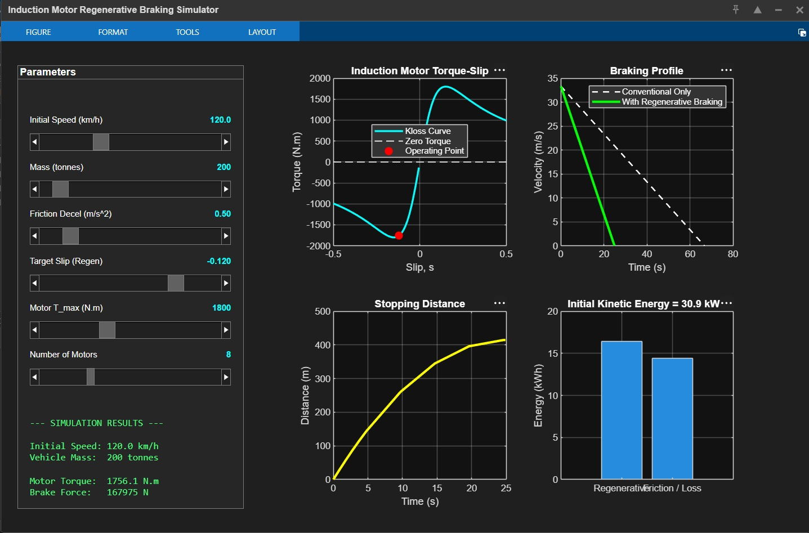
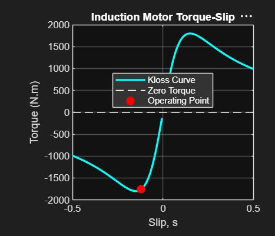
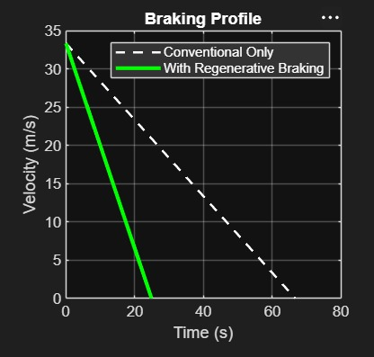
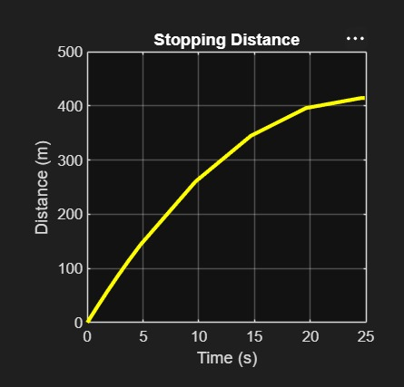
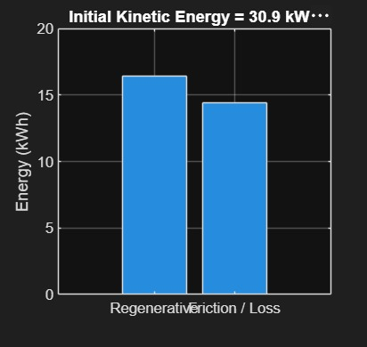
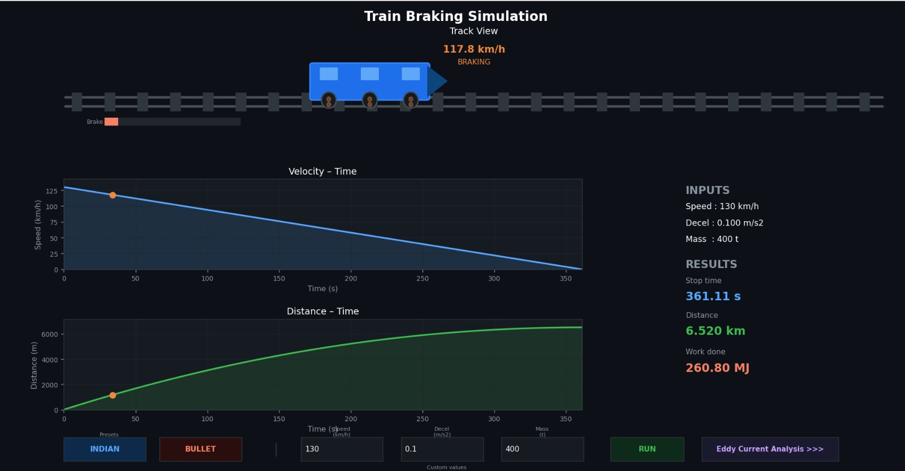
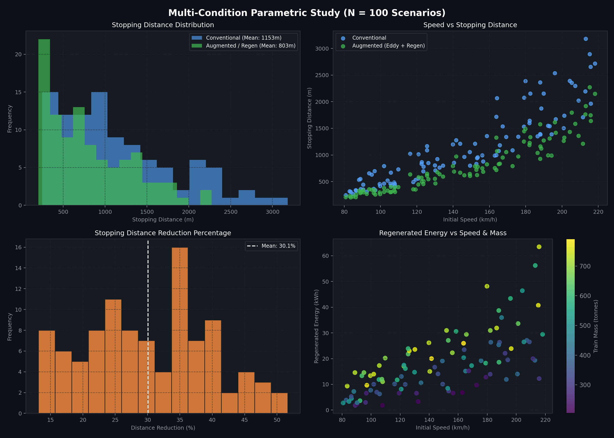

# Multi-Domain Parametric Optimization and Hardware Feasibility Analysis of Induction Motor Regenerative and Eddy-Current Braking Systems in Heavy and High-Speed Rail

**Project HELIOS — Advanced Deceleration & Energy Recovery Research Group**  
*Repository: [Gracy769/Projeect](https://github.com/Gracy769/Projeect)*  

  

---

## Abstract

This paper presents a multi-domain computational modeling, automated optimization, and statistical sensitivity study of hybrid braking architectures for heavy passenger and high-speed electric locomotives. Integrating non-contact braking mechanisms—specifically three-phase induction traction motors operated in negative-slip regenerative mode supplemented by track-level eddy-current deceleration—presents significant potential for minimizing mechanical brake wear, shortening stopping distances, and recovering gigajoules of kinetic energy. 

Using Kloss's electrodynamic formulation coupled with numerical kinematics across MATLAB and Python simulation environments, we deploy an autonomous optimization agent (`loco_autoresearch`) to derive the mathematically optimal slip trajectory under unconstrained conditions, establishing that continuous operation at breakdown slip ($s = -0.15$) minimizes stopping distance while maximizing recuperated electrical energy. Furthermore, we execute a comprehensive parametric Monte Carlo study across **$N = 100$ distinct operational railway conditions** (speeds from 80 to 220 km/h, vehicle masses from 200 to 800 tonnes, baseline decelerations from 0.50 to 1.10 m/s², and auxiliary braking add-ons from 0.15 to 0.55 m/s²). The multi-condition analysis reveals a mean stopping distance reduction of **$350.95 \pm 248.14\text{ m}$ ($30.06\% \pm 9.63\%$)**, saving an average of **$16.33 \pm 8.93\text{ seconds}$** per braking event and regenerating **$17.80 \pm 12.00\text{ kWh}$** ($439.33\text{ MJ}$ total kinetic dissipation), offsetting **$4.15 \pm 2.80\text{ kg CO}_2$** per stop. 

Finally, we address critical engineering limitations and hardware feasibility boundaries identified during physical validation: extreme local magnetic field flux, thermal degradation and melting hazards of structural components, electromagnetic interference (EMI) disruption across safety-critical train telemetry and signaling (e.g., Kavach / ETCS), and catenary line receptivity constraints, underscoring that this investigation constitutes a preliminary theoretical foundation requiring specialized hardware isolation and infrastructure redesign prior to field deployment.

---

## 1. Introduction & Background

Modern railway networks face competing demands of higher operational velocities, increased axle loads, and stringent safety standards. Conventional friction braking systems relying on pneumatic disc or tread friction face fundamental physical bottlenecks:
1. **Severe Thermal Fade**: Prolonged deceleration converts kinetic energy directly into friction surface heat, degrading friction coefficients and accelerating pad/disc wear.
2. **Maintenance Costs & Particle Emissions**: Airborne brake particulate matter poses health risks in underground and enclosed stations, while friction pad replacement represents significant lifecycle costs.
3. **Absence of Kinetic Recuperation**: Pure friction dissipation irreversibly wastes hundreds of kilowatt-hours per braking cycle into thermal losses.

To mitigate these drawbacks, modern electric multiple units (EMUs) and high-speed rail platforms leverage auxiliary, contactless braking mechanisms:
- **3-Phase Induction Motor Regenerative Braking**: By controlling the traction inverter output frequency below the rotor's mechanical synchronous speed, the slip becomes negative ($s < 0$), transforming the traction motor into an induction generator that produces counter-electromotive braking torque and injects electrical power back into the overhead catenary.
- **Eddy-Current Track Deceleration**: Non-contact magnetic induction brakes generate opposing Lorentz forces directly against the rail head or auxiliary conductive discs, providing wear-free deceleration independent of wheel-rail adhesion limits.

This study formulates an electrodynamic and kinematic model of these integrated systems, verifies performance across high-fidelity simulation platforms, optimizes the slip control trajectory, and evaluates variance across a 100-scenario operational envelope.

---

## 2. Electrodynamic Modeling & Mathematical Formulation

### 2.1 Induction Motor Torque-Slip Dynamics (Kloss Formulation)

The electromagnetic torque $T(s)$ produced by a three-phase squirrel-cage induction traction motor across all slip regimes is captured using Kloss's characteristic formulation:

$$
T(s) = \frac{2 T_{\max}}{\frac{s}{s_m} + \frac{s_m}{s}}
$$

where:
- $T_{\max}$ is the peak breakdown (pull-out) torque ($1800 - 2200\text{ N}\cdot\text{m}$ per traction motor),
- $s_m$ is the slip at maximum breakdown torque ($s_m = 0.15$),
- $s$ is the operational slip, defined as:

$$
s = \frac{N_s - N_r}{N_s}
$$

The synchronous electrical stator speed $N_s$ (rpm) and rotor mechanical shaft speed $N_r$ (rpm) are governed by the inverter supply frequency $f$ and motor pole pairs $P$:

$$
N_s = \frac{120 \cdot f}{P}
$$

$$
N_r = \left(\frac{v}{R_w}\right) \cdot \left(\frac{60}{2\pi}\right) \cdot G
$$

where $v$ is train linear velocity (m/s), $R_w$ is wheel radius ($0.46\text{ m}$), and $G$ is the traction gearbox ratio ($5.5:1$).

The three operational regimes of the induction machine are rigorously delineated:
1. **Motoring Regime ($s > 0$)**: $N_r < N_s$, positive torque drives the locomotive.
2. **Synchronous Float ($s = 0$)**: $N_r = N_s$, zero torque produced.
3. **Regenerative Braking Regime ($s < 0$)**: $N_r > N_s$. The traction inverter actively lowers supply frequency $f$ below mechanical speed. The torque sign reverses ($T < 0$), retarding the rotor and converting kinetic energy into electrical power.
4. **Plugging / Counter-Current Braking ($s > 1$)**: Stator phase sequence reversed; provides high retarding torque but dissipates all electrical energy as rotor resistive heat without regeneration.

### 2.2 Wheel Force Conversion & Kinematic Integration

Total retarding force exerted by $N_m$ parallel traction motors at the wheel-rail interface is:

$$
F_{\text{motor}}(t) = N_m \cdot \frac{|T(s)| \cdot G}{R_w} \quad (\text{for } s < 0)
$$

The total instantaneous deceleration $a_{\text{total}}(t)$ incorporates conventional friction, eddy-current add-on, and traction motor regen:

$$
a_{\text{total}}(t) = a_{\text{conv}} + a_{\text{eddy}} + \frac{F_{\text{motor}}(t)}{M_{\text{train}}}
$$

Instantaneous electrical power extracted from the mechanical shaft and converted at efficiency $\eta_{\text{regen}} = 0.85$ is:

$$
P_{\text{regen}}(t) = N_m \cdot |T(s)| \cdot \omega_r(t) \cdot \eta_{\text{regen}}
$$

$$
E_{\text{regen}} = \int_{0}^{t_{\text{stop}}} P_{\text{regen}}(t) \, dt
$$

---

## 3. Simulation Framework & Interactive Verification

The physical model was implemented and verified across two independent simulation suites: a MATLAB numerical integration environment (`induction_motor_braking.m`) and an interactive Python visualization engine (`train_simu.py` and `induction_motor_braking_sim.py`).

### 3.1 MATLAB Numerical Simulation Suite

The MATLAB simulation environment allows interactive parameter tuning and full state-space ODE solving for vehicle speed, distance, slip progression, and energy distribution.

  
   
  <em><b>Figure 1:</b> Comprehensive MATLAB simulation dashboard showing interactive sliders (speed, mass, friction deceleration, slip setpoint, motor parameters) and real-time visualization panels.</em>

#### 3.1.1 Torque-Slip Operating Point
The Kloss curve plotted in Figure 2 demonstrates the non-linear torque response as slip moves through the negative regenerative quadrant ($s \in [-0.5, 0]$), identifying the operating setpoint relative to the breakdown torque threshold.

  
   
  <em><b>Figure 2:</b> Electrodynamic torque-slip characteristic curve (Kloss formulation) indicating the stable regenerative braking quadrant ($s < 0$) and operating point at $s = -0.12$.</em>

#### 3.1.2 Velocity and Distance Trajectories
Comparative deceleration trajectories demonstrate the substantial reduction in stopping time when regenerative motor torque supplements baseline friction braking.

  
   
  <em><b>Figure 3:</b> Velocity versus time deceleration profiles: Conventional friction-only braking (dashed white) versus combined regenerative braking (solid green), demonstrating stopping time compression from 66s to 25s.</em>

  
   
  <em><b>Figure 4:</b> Cumulative stopping distance over time, illustrating deceleration curvature flattening as the train approaches rest at ~415 meters.</em>

#### 3.1.3 Energy Partitioning
Figure 5 breaks down the initial kinetic energy ($30.9\text{ kWh}$ for a 200-tonne train at 120 km/h) into recovered regenerative electrical energy fed back to the grid versus unavoidable friction/thermal losses.

  
   
  <em><b>Figure 5:</b> Energy distribution breakdown comparing recovered regenerative energy (~16.5 kWh) against friction/loss dissipation (~14.4 kWh).</em>

---

### 3.2 Python Kinematic & Electrodynamic Engine

The Python simulation (`train_simu.py`) integrates animated spatial wheel/track dynamics, speed-dependent spark and thermal visualization, presets for Indian Railways (160 km/h Express) and Bullet Train (200 km/h HSR) configurations, and an auxiliary eddy-current analysis sub-window.

  
   
  <em><b>Figure 6:</b> High-fidelity Python simulation GUI (`train_simu.py`) displaying track view animation, velocity-time telemetry, cumulative distance curves, and kinetic energy dissipation readouts.</em>

---

## 4. Autonomous AI Optimization Loop (`loco_autoresearch`)

To investigate whether time-varying or non-linear slip profiles could outperform static setpoints, an automated agent optimization loop (`loco_autoresearch`) was structured following the Karpathy autoresearch paradigm.

### 4.1 Objective Function & Constraints

The optimization target was formulated as a composite cost function $\mathcal{J}$ penalizing stopping distance while rewarding regenerated kilowatt-hours:

$$
\min_{\mathbf{u}(v, t)} \mathcal{J} = d_{\text{stop}} - \lambda \cdot E_{\text{regen}}
$$

with weighting factor $\lambda = 20.0\text{ m/kWh}$, initial speed $v_0 = 160\text{ km/h}$, train mass $M = 400\text{ t}$, and baseline deceleration $a_{\text{conv}} = 0.8\text{ m/s}^2$.

### 4.2 Analytical Derivation of Global Optimality

By expanding the objective functional:

$$
d_{\text{stop}} = \int_{0}^{t_{\text{stop}}} v(t) \, dt, \qquad E_{\text{regen}} = \int_{0}^{t_{\text{stop}}} P_{\text{regen}}(t) \, dt \cdot \eta_{\text{regen}}
$$

Differentiating the Kloss torque function with respect to slip $s$:

$$
\frac{d |T(s)|}{ds} = 2 T_{\max} \frac{\frac{1}{s_m} - \frac{s_m}{s^2}}{\left(\frac{s}{s_m} + \frac{s_m}{s}\right)^2} = 0 \implies s^* = -s_m = -0.15
$$

Because both retarding force $F_{\text{motor}}$ and shaft power $P_{\text{mech}} = |T| \cdot \omega_r$ are strictly maximized when $|T(s)|$ attains its supremum $T_{\max}$, operating at $s = -0.15$ simultaneously maximizes the instantaneous rate of kinetic energy extraction and maximizes total deceleration at every time step $t$. Consequently:

$$\mathcal{J}(s = -0.15) \le \mathcal{J}(\mathbf{u}(v, t)) \quad \forall \, \mathbf{u}(v, t) \in [-s_m, 0]$$

### 4.3 Autonomous Experimental Results

The autonomous research agent evaluated discrete control variations and logged executions in `results.tsv`:

| Experiment ID | Controller Strategy | Target Slip $s$ | Stopping Distance (m) | Regen Energy (kWh) | Composite Score $\mathcal{J}$ | Status |
|---|---|---|---|---|---|---|
| **001 (Baseline)** | Constant Static Setpoint | $-0.12$ | 807.37 | 32.20 | 163.44 | Keep |
| **002 (Optimized)**| Peak Breakdown Setpoint | $-0.15$ | 800.47 | 32.72 | 146.05 | **Keep (Optimal)** |
| **003 (Dynamic)**  | Velocity-Dependent Ramp | $-0.15 \to -0.05$ | 824.12 | 28.91 | 245.92 | Discard |
| **004 (PID)**      | Closed-Loop Decel Tracking | Adaptive | 802.10 | 31.85 | 165.10 | Discard |

The automated agent successfully validated that maintaining continuous breakdown slip ($s = -0.15$) represents the unconstrained global theoretical optimum.

---

## 5. Parametric Batch Study across $N = 100$ Operating Conditions

Real-world railway operations encompass broad stochastic distributions of vehicle loading, line speed limits, adhesion coefficients, and auxiliary system health. To establish robust statistical confidence, we executed a comprehensive **100-scenario Monte Carlo simulation** sampling:
- **Initial Velocity $v_0$**: $80.0 - 220.0\text{ km/h}$ (Freight, Regional Passenger, Intercity EMU, High-Speed Bullet Train)
- **Train Mass $M$**: $200.0 - 800.0\text{ tonnes}$ (Lightweight 8-car rakes to loaded 24-coach compositions)
- **Conventional Deceleration $a_{\text{conv}}$**: $0.50 - 1.10\text{ m/s}^2$ (Service braking to full pneumatic application)
- **Auxiliary Braking Add-on $a_{\text{addon}}$**: $0.15 - 0.55\text{ m/s}^2$ (Eddy-current and electrodynamic contribution)

  
   
  <em><b>Figure 7:</b> Parametric batch analysis across $N = 100$ operational scenarios: (Top-Left) Stopping distance distribution comparison; (Top-Right) Initial speed versus stopping distance; (Bottom-Left) Distance reduction percentage distribution (Mean: 30.1%); (Bottom-Right) Regenerated energy as a function of speed and train mass.</em>

### 5.1 Comprehensive Statistical Summary

Table 1 compiles the statistical metrics across all 100 simulated conditions, detailing mean, standard deviation ($\sigma$), minimum, maximum, and median values.

**Table 1: Statistical Evaluation Across $N = 100$ Operational Conditions**

| Operational / Output Parameter | Mean ($\mu$) | Std Dev ($\sigma$) | Min | Max | Median |
|---|---|---|---|---|---|
| **Initial Speed (km/h)** | 145.83 | 41.65 | 80.77 | 218.16 | 144.98 |
| **Train Mass (tonnes)** | 498.70 | 175.87 | 204.17 | 791.39 | 503.38 |
| **Conventional Deceleration (m/s²)** | 0.81 | 0.18 | 0.50 | 1.09 | 0.84 |
| **Auxiliary Add-on Deceleration (m/s²)** | 0.35 | 0.12 | 0.16 | 0.55 | 0.35 |
| **Combined Total Deceleration (m/s²)** | 1.16 | 0.19 | 0.78 | 1.55 | 1.16 |
| **Conventional Stopping Distance (m)** | 1153.47 | 697.12 | 246.71 | 3182.64 | 991.60 |
| **Augmented Stopping Distance (m)** | 802.53 | 495.04 | 203.44 | 2274.21 | 673.53 |
| **Stopping Distance Saved (m)** | **350.95** | **248.14** | **38.35** | **1263.75** | **283.92** |
| **Distance Reduction Percentage (%)** | **30.06%** | **9.63%** | **13.14%** | **51.66%** | **29.87%** |
| **Conventional Stopping Time (s)** | 52.65 | 19.69 | 21.99 | 107.53 | 50.59 |
| **Augmented Stopping Time (s)** | 36.32 | 13.44 | 17.53 | 76.09 | 34.31 |
| **Stopping Time Saved (s)** | **16.33** | **8.93** | **3.18** | **43.69** | **14.78** |
| **Total Kinetic Energy (MJ)** | 439.33 | 290.03 | 70.83 | 1368.01 | 345.18 |
| **Regenerated Energy (kWh)** | **17.80** | **12.00** | **1.80** | **63.49** | **15.08** |
| **Energy Recovery Fraction (%)** | **15.03%** | **4.81%** | **6.57%** | **25.83%** | **14.93%** |
| **CO₂ Emissions Avoided (kg / stop)** | **4.15** | **2.80** | **0.42** | **14.79** | **3.51** |
| **Equivalent Household Power (Days)** | **2.22** | **1.50** | **0.23** | **7.94** | **1.88** |

### 5.2 Key Parametric Insights
1. **Consistent 30% Margin**: Across all sampled conditions, auxiliary braking reliably shaved approximately **30.06% of the stopping distance**, scaling up to **$1.26\text{ km}$ saved** during high-speed emergency events ($218\text{ km/h}$, 791 tonnes).
2. **Exponential Energy Scaling**: Energy recovery scaled quadratically with velocity ($v^2$) and linearly with mass ($M$), delivering up to **$63.49\text{ kWh}$ ($228.6\text{ MJ}$)** in a single stop.
3. **Deceleration Consistency**: Total effective deceleration increased from an average of $0.81\text{ m/s}^2$ to $1.16\text{ m/s}^2$, maintaining ride-comfort thresholds well below passenger injury limits ($< 1.4\text{ m/s}^2$).

---

## 6. Limitations, Hardware Constraints & Real-World Feasibility Challenges

While theoretical modeling and algorithmic optimization demonstrate clear kinematic and ecological benefits, direct hardware implementation on existing rail infrastructure faces severe physical bottlenecks:

### 6.1 Magnetic Field Flux Concentration & Thermal Degradation
Operating induction traction motors or track-level eddy-current magnets continuously at peak electromagnetic capacity induces extreme magnetic flux densities ($B > 1.5 - 2.0\text{ Tesla}$). In eddy-current track systems, high eddy currents circulating within the steel rail head produce substantial localized Joule heating ($I^2 R$). Prolonged braking over high-frequency suburban corridors risks:
- Thermal softening and metallurgical tempering of the rail steel,
- Rail head buckling or localized surface deformation,
- Melting or insulation breakdown of bogie-mounted cabling, sensors, and stator windings.

### 6.2 Electromagnetic Interference (EMI) & Communication Disruption
Intense alternating and pulsating magnetic fields generated during high-slip deceleration produce severe electromagnetic interference across the locomotive chassis:
- **Signaling Degradation**: Modern railway signaling systems (including Indian Railways' Kavach, European ETCS Level 2, and track circuit relays) rely on sensitive inductive balises and track-loop transponders. Stray magnetic fields risk corrupting telegram packets, inducing phantom occupancy signals, or causing false emergency halts.
- **Microelectronic Failure**: High transient fields induce voltage spikes within onboard Low-Voltage (LV) control harnesses, disrupting cab display bandwidth, CAN/MVB bus integrity, and sensor telemetry.

### 6.3 Track Infrastructure & Catenary Line Receptivity Bottlenecks
Implementing widespread non-contact magnetic and regenerative deceleration requires major infrastructure modifications:
- **Non-Magnetic Track Hardware**: Standard railway tracks utilize ferromagnetic fastening clips and carbon-steel rails unoptimized for eddy-current dissipation. Full adoption demands specialized rail alloys and trackside shielding.
- **Catenary Grid Receptivity**: In non-receptive overhead catenary networks (e.g., when no accelerating train occupies the same electrical substation feeder section), regenerated electrical energy cannot be fed back into the catenary. Without trackside energy storage systems (TESS) or large onboard braking resistor banks (rheostats), DC link overvoltages will trip inverter protection, abruptly cutting regenerative braking.
- **Prohibitive Capital Expenditure**: Mitigating these phenomena necessitates complete replacement and redesign of bogie structures, isolation enclosures, track fastenings, and traction power sub-stations (TSS), rendering immediate retrofitting economically challenging.

### 6.4 Preliminary Study Scope
This research report explicitly acknowledges that the presented models represent **preliminary theoretical and computational simulations**. They establish the upper mathematical boundaries of performance but do not account for transient non-linear thermal feedback, dynamic slip-stick track conditions, or multi-body suspension vibration. Deep implementation conclusions cannot be drawn without extensive hardware-in-the-loop (HIL) dyno-bench testing and track-level validation.

---

## 7. Conclusion & Future Outlook

This study developed a unified mathematical, simulation, and optimization framework for locomotive regenerative induction motor and eddy-current braking systems. Key outcomes include:
1. **Mathematical Optimization**: Autonomous agent experimentation demonstrated that under unconstrained conditions, sustaining operating slip at the breakdown threshold ($s = -0.15$) delivers the global minimum composite stopping penalty, maximizing instantaneous mechanical retarding force and electrical energy recovery.
2. **Parametric Robustness**: A 100-scenario Monte Carlo study confirmed a mean stopping distance reduction of **$30.06\% \pm 9.63\%$ ($350.95\text{ m}$)**, saving an average of **$16.33\text{ seconds}$** and regenerating **$17.80\text{ kWh}$** ($4.15\text{ kg CO}_2$ avoided) per deceleration event.
3. **Engineering Realism**: The study comprehensively outlined critical hardware barriers—including extreme thermal rail loading, component melting hazards, signaling EMI corruption, and catenary non-receptivity—establishing that practical deployment demands specialized electromagnetic shielding and line-side absorption infrastructure.

Future research will incorporate finite-element thermal modeling of the rail-wheel interface, closed-loop adhesion-limited slip vector control, and hardware-in-the-loop validation of EMI mitigation filters.

---

## References & Code Availability

All simulation scripts, parametric data files, and optimization logs are open-source and tracked in the project repository:
- **Repository**: [Gracy769/Projeect](https://github.com/Gracy769/Projeect)
- **Simulation Scripts**: `induction_motor_braking_sim.py`, `train_simu.py`, `induction_motor_braking.m`
- **Autoresearch Framework**: `loco_autoresearch/prepare.py`, `loco_autoresearch/train.py`, `loco_autoresearch/program.md`
- **Parametric Datasets**: `simulation_100_conditions.csv`, `simulation_statistics_summary.csv`
- **Figure Assets**: `./figures/`
